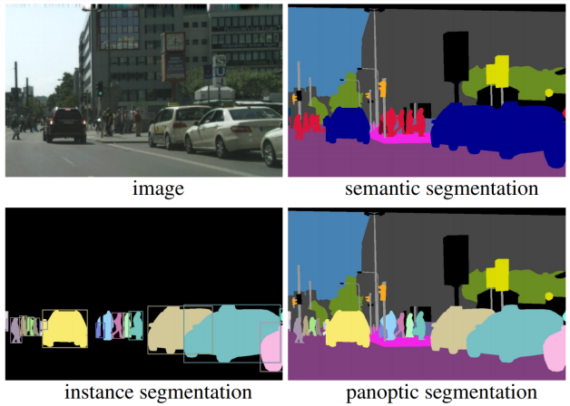

```{r setup, include=FALSE}
knitr::opts_chunk$set(echo = TRUE)
```

## An Introduction to Image Segmentation

**Image segmentation** is the process of partitioning an image into several coherent sub-regions according to some extracted features (*e.g.*, color, brightness, texture attributes). It plays an important role in a broad range of applications, including video surveillance, augmented reality, recognition tasks (face, fingerprints, iris, etc.), autonomous vehicles (navigable surface, object detection, etc.) or **medical image analyse**, just to name a few. Segmentation aims to extract meaningful information for easier and enhanced analysis; as an illustrative example, a diagnosis based on a set of features extracted from a segmented CT scan of a lung will most probably provide more accurate results than another one where the lung is not isolated.

Many distinct segmentation methods and algorithms have been discussed in the literature, and there are several ways to classify them. For instance, they can be classified into those: **semantic segmentation**, which performs pixel-level labeling with a set of object categories (*e.g.*, car, human) for all image pixels, and **instance segmentation**, which extends semantic segmentation scope further by detecting and delineating each object of interest in the image. Also, there is another type called **panoptic segmentation** which is the unified version of the two basic segmentation processes.

```{r, echo=FALSE, fig.cap = "An example of diferent types of image segmentation.", label="SemInsPan", out.width="50%", out.height=="50%", fig.align="center"}

```

They can also be split into three categories: **manual**, **semiautomatic**, and **automatic**. While an advantage of manual segmentation method is that we can use expert knowledge (as it is usually performed by an expert), its drawbacks are that it is very time consuming and prone to intra and interobserver variability, which can result in a large difference in the extracted features.

Semiautomatic segmentation tries to solve some of the problems related to manual segmentation; by using algorithms, the effort and time spent by the user can be reduced. Semiautomatic algorithms aim to reduce the inter and intraobserver variability. However, interobserver variability will still be present, as the manual part of the segmentation and the settings of the algorithm influence the result.

Automatic segmentation methods do not rely on user interaction, and can be split
into two categories: learning and nonlearning-based. **Deep learning** recently has become
very popular as a learning-based method, where the segmentation is performed
by a **neural network** that is trained with labeled examples. The advantage of automatic segmentation is that once the method has been constructed, the segmentations can be performed relatively quickly. Moreover, they produce segmentations that are consistent and reproducible. The disadvantage of deep learning is that it usually requires a lot of labeled data to train an accurate model, as well as a long training time and specialized hardware to construct the model.

According to its architecture, image segmentation algorithms can be grouped into different types, such as:

* **Threshold Segmentation**. They are the primary methods of image segmentation, in which one threshold value is used to change a greyscale image into a binary image.

* **Edge Detection Segmentation**. These methods are based on the detection of the separation between two areas having distinct intensity or grey levels (called edges).

* **Region-based Segmentation**. In this segmentation we grow regions by recursively including the neighboring pixels that are similar and connected to a seed pixel.

* **Cluster-based Segmentation**. Clustering algorithms are used to group closer the data points that are more similar to each other, from other group data points.

* **Model-based Segmentation**. In [@MBS] is defined as the assignment of labels to pixels or voxels by matching the a priori known object model to the image data. Model-based approaches have been set up as probably the best strategies for picture analysis, and include Markov Random Field models, Atlas-based models, Graph cut models or Artificial Neural Networks, among others. 


## Bibliography


