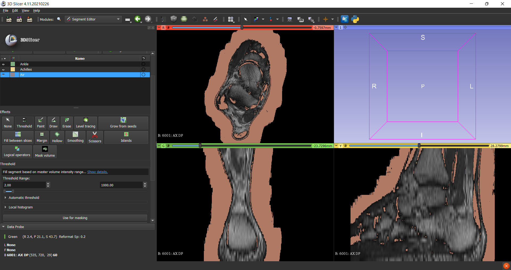
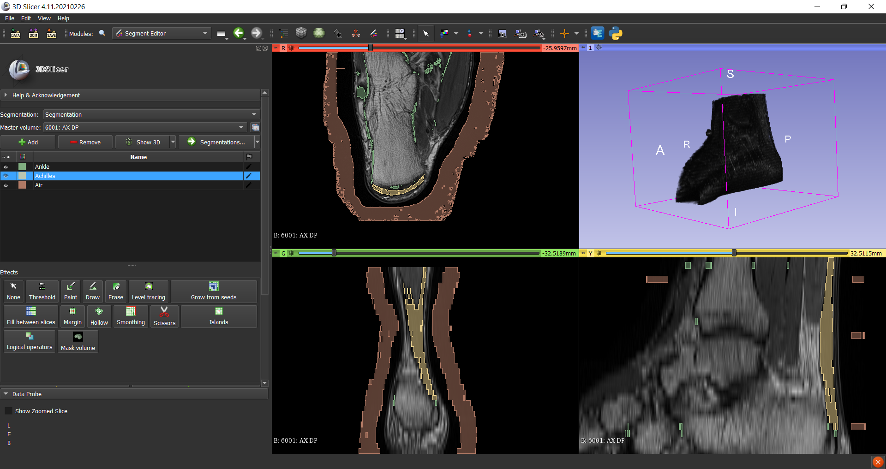
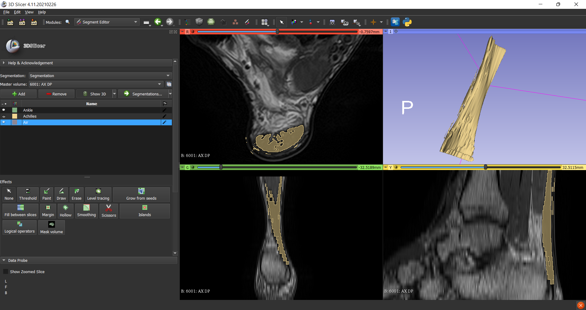
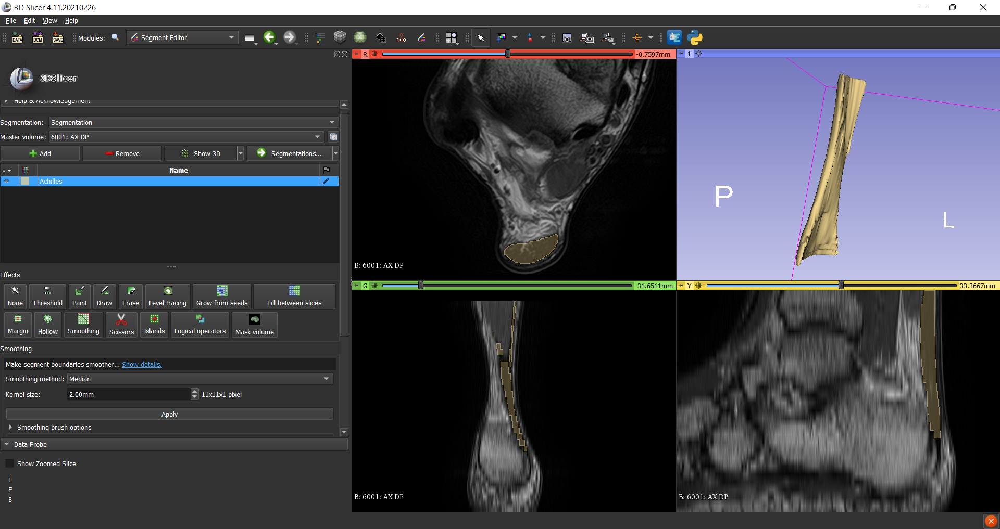
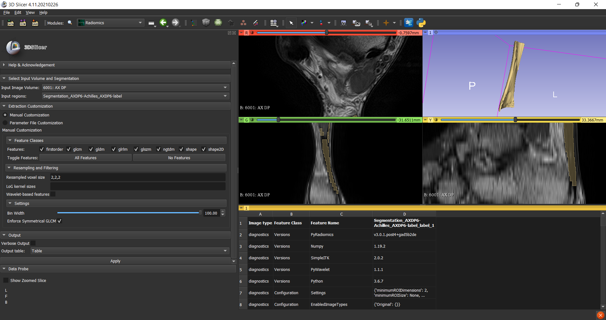

```{r setup, include=FALSE}
knitr::opts_chunk$set(echo = TRUE)
```

# An Introduction to Image Segmentation

**Image segmentation** is the process of partitioning an image into several coherent sub-regions according to some extracted features (*e.g.*, color, brightness, texture attributes). It plays an important role in a broad range of applications, including video surveillance, augmented reality, recognition tasks (face, fingerprints, iris, etc.), autonomous vehicles (navigable surface, object detection, etc.) or **medical image analyse**, just to name a few. Segmentation aims to extract meaningful information for easier and enhanced analysis; as an illustrative example, a diagnosis based on a set of features extracted from a segmented CT scan of a lung will most probably provide more accurate results than another one where the lung is not isolated.

Many distinct segmentation methods and algorithms have been discussed in the literature, and there are several ways to classify them. For instance, they can be classified into those: **semantic segmentation**, which performs pixel-level labeling with a set of object categories (*e.g.*, car, human) for all image pixels, and **instance segmentation**, which extends semantic segmentation scope further by detecting and delineating each object of interest in the image. Also, there is another type called **panoptic segmentation** which is the unified version of the two basic segmentation processes.

```{r, echo=FALSE, fig.cap = "An example of diferent types of image segmentation.", label="SemInsPan", out.width="50%", out.height=="50%", fig.align="center", cache=TRUE}
knitr::include_graphics("./Images/SemanticInstancePanoptic.png")
```

They can also be split into three categories: **manual**, **semiautomatic**, and **automatic**. While an advantage of manual segmentation method is that we can use expert knowledge (as it is usually performed by an expert), its drawbacks are that it is very time consuming and prone to intra and interobserver variability, which can result in a large difference in the extracted features.

Semiautomatic segmentation tries to solve some of the problems related to manual segmentation; by using algorithms, the effort and time spent by the user can be reduced. Semiautomatic algorithms aim to reduce the inter and intraobserver variability. However, interobserver variability will still be present, as the manual part of the segmentation and the settings of the algorithm influence the result.

Automatic segmentation methods do not rely on user interaction, and can be split
into two categories: learning and nonlearning-based. **Deep learning** recently has become
very popular as a learning-based method, where the segmentation is performed
by a **neural network** that is trained with labeled examples. The advantage of automatic segmentation is that once the method has been constructed, the segmentations can be performed relatively quickly. Moreover, they produce segmentations that are consistent and reproducible. The disadvantage of deep learning is that it usually requires a lot of labeled data to train an accurate model, as well as a long training time and specialized hardware to construct the model.

According to its architecture, image segmentation algorithms can be grouped into different types, such as:

* **Threshold Segmentation**. They are the primary methods of image segmentation, in which one threshold value is used to change a greyscale image into a binary image.

* **Edge Detection Segmentation**. These methods are based on the detection of the separation between two areas having distinct intensity or grey levels (called edges).

* **Region-based Segmentation**. In this segmentation we grow regions by recursively including the neighboring pixels that are similar and connected to a seed pixel.

* **Cluster-based Segmentation**. Clustering algorithms are used to group closer the data points that are more similar to each other, from other group data points.

* **Model-based Segmentation**. In [@MBS] is defined as the assignment of labels to pixels or voxels by matching the a priori known object model to the image data. Model-based approaches have been set up as probably the best strategies for picture analysis, and include Markov Random Field models, Atlas-based models, Graph cut models or Artificial Neural Networks, among others. 

# DICOM Processing and Segmentation in Python

**DICOM** (Digital Imaging and Communications in Medicine) is a standard protocol for the management and transmission of medical images and related data and is used in many healthcare facilities. This section is dedicated to visualizing Achilles tendon CT images (DICOM files) in 1D (by histogram), 2D, and 3D. Finally, we will create segmentation masks that remove all voxels except for the Achilles tendon. In order to achieve this, we'll run a Python code based on the one from [@DICOMProcSegm] in RStudio using the library `reticulate`. 

## Getting Ready

The `reticulate` package provides a comprehensive set of tools for interoperability between Python and R. Thus, we'll start by installing and loading it (see [@reticulate] and [@reticulate2]). Now we are almost ready to run Python code in RStudio. Before doing this, we must install some Python modules (if they have not been installed yet) by running the following command lines (in Terminal):

`pip install pydicom`

`conda install plotly`

`conda install scikit-image` (make sure you are using scikit-image 0.13 or above)

`pip install sklearn`

`pip install matplotlib`

## Import packages

Once we are working in a Python environment, let us begin by importing the following packages:

```{python, echo=TRUE, results='hide'}
import numpy as np
import pydicom
import os
import matplotlib.pyplot as plt
from glob import glob
from mpl_toolkits.mplot3d.art3d import Poly3DCollection
import scipy.ndimage
from skimage import morphology
from skimage import measure
from skimage.transform import resize
from sklearn.cluster import KMeans
from plotly import __version__
from plotly.offline import download_plotlyjs, init_notebook_mode, plot, iplot
from plotly.tools import FigureFactory as FF
from plotly.graph_objs import *
from pydicom.pixel_data_handlers.util import apply_modality_lut
import plotly.figure_factory
import matplotlib
```

To specify the input and output data folders path:

```{python, results='hide', collapse=TRUE}
data_path = "./Images/DICOM/AX DP 1RA68062501 (id=1)/FILESET"
output_path = working_path = "./Images/DICOM/AX DP 1RA68062501 (id=1)"
g = glob(data_path + '/*')
# Print out the first 5 file names to verify we are in the right folder
print ("Total of %d DICOM images.\nFirst 5 filenames:" % len(g))
print ('\n'.join(g[:5]))
```

## Helper Functions

* `load_scan`: loads all DICOM images from a folder into a list for manipulation.
* `get_pixels_hu`: converts raw voxel and pixel values into [Houndsfield Units](https://www.ncbi.nlm.nih.gov/books/NBK547721/), which are a relative quantitative measurement of radiodensity used by radiologists in the interpretation of computed tomography (CT) images.

```{python, echo=FALSE, results='hide', warnings=FALSE, message=FALSE}
def load_scan(path):
    slices = [pydicom.read_file(path + '/' + s) for s in os.listdir(path)]
    slices.sort(key = lambda x: int(x.InstanceNumber))
    try:
        slice_thickness = np.abs(slices[0].ImagePositionPatient[2] - slices[1].ImagePositionPatient[2])
    except:
        slice_thickness = np.abs(slices[0].SliceLocation - slices[1].SliceLocation)
        
    for s in slices:
        s.SliceThickness = slice_thickness
        
    return slices

def get_pixels_hu(scans):
    image = np.stack([s.pixel_array for s in scans])
    # Convert to int16 (from sometimes int16), 
    # should be possible as values should always be low enough (<32k)
    image = image.astype(np.int16)

    # Set outside-of-scan pixels to 1
    # The intercept is usually -1024, so air is approximately 0
    image[image == -2000] = 0
    
    # Convert to Hounsfield units (HU)
    intercept = scans[0].RescaleIntercept if 'RescaleIntercept' in scans[0] else -1024
    slope = scans[0].RescaleSlope if 'RescaleSlope' in scans[0] else 1
    
    image = slope * image.astype(np.float64)
    image = image.astype(np.int16)
    image += np.int16(intercept)
    
    return np.array(image, dtype=np.int16)

id=1
patient = load_scan(data_path)
patient_pixels = get_pixels_hu(patient)

#Save the new data to disk
np.save(output_path + "/fullimages_%d.npy" % (id), patient_pixels)

#1D-Visualisation

file_used=output_path+"/fullimages_%d.npy" % id
patient_pixels = np.load(file_used).astype(np.float64)

plt.hist(patient_pixels.flatten(), bins=50, color='c')
plt.xlabel("Hounsfield Units (HU)")
plt.ylabel("Frequency")
plt.show()
```

## Dispaying an Image Stack

We'll be skipping every 2 slices to get a representative look at the study.

```{python}
id = 1
imgs_to_process = np.load(output_path+'/fullimages_{}.npy'.format(id))
def sample_stack(stack, rows=4, cols=5, start_with=0, show_every=2):
    fig,ax = matplotlib.pyplot.subplots(rows,cols,figsize=[12,12])
    #matplotlib.pyplot.subplots_adjust(hspace=0.25)
    for i in range(rows*cols):
        ind = start_with + i*show_every
        ax[int(i/cols),int(i % cols)].set_title('slice %d' % ind)
        ax[int(i/cols),int(i % cols)].imshow(stack[ind],cmap='gray')
        ax[int(i/cols),int(i % cols)].axis('off')
    plt.show()
sample_stack(imgs_to_process)
```

## Resampling

```{python}
print ("Slice Thickness: %f" % patient[0].SliceThickness)
print ("Pixel Spacing (row, col): (%f, %f) " % (patient[0].PixelSpacing[0], patient[0].PixelSpacing[1]))
id = 1
imgs_to_process = np.load(output_path+'/fullimages_{}.npy'.format(id))
def resample(image, scan, new_spacing=[1,1,1]):
    # Determine current pixel spacing
    spacing = map(float, ([scan[0].SliceThickness] + list(scan[0].PixelSpacing)))
    spacing = np.array(list(spacing))
    resize_factor = spacing / new_spacing
    new_real_shape = image.shape * resize_factor
    new_shape = np.round(new_real_shape)
    real_resize_factor = new_shape / image.shape
    new_spacing = spacing / real_resize_factor
    
    image = scipy.ndimage.interpolation.zoom(image, real_resize_factor)
    
    return image, new_spacing
print ("Shape before resampling\t", imgs_to_process.shape)
imgs_after_resamp, spacing = resample(imgs_to_process, patient, [1,1,1])
print ("Shape after resampling\t", imgs_after_resamp.shape)
```

## 3D Plotting

```{python, warnings=FALSE, cache=TRUE}
def make_mesh(image, threshold=-300, step_size=1):
    print ("Transposing surface")
    p = image.transpose(2,1,0)
    
    print ("Calculating surface")
    verts, faces, norm, val = measure.marching_cubes(p, threshold, step_size=step_size, allow_degenerate=True) 
    return verts, faces
def plotly_3d(verts, faces):
    x,y,z = zip(*verts) 
    
    print ("Drawing")
    
    # Make the colormap single color since the axes are positional not intensity. 
#    colormap=['rgb(255,105,180)','rgb(255,255,51)','rgb(0,191,255)']
    colormap=['rgb(236, 236, 212)','rgb(236, 236, 212)']
    
    fig = plotly.figure_factory.create_trisurf(x=x,
                        y=y, 
                        z=z, 
                        plot_edges=False,
                        colormap=colormap,
                        simplices=faces,
                        backgroundcolor='rgb(64, 64, 64)',
                        title="Interactive Visualization")
    iplot(fig)
def plt_3d(verts, faces):
    print ("Drawing")
    x,y,z = zip(*verts) 
    fig = plt.figure(figsize=(10, 10))
    ax = fig.add_subplot(111, projection='3d')
    # Fancy indexing: `verts[faces]` to generate a collection of triangles
    mesh = Poly3DCollection(verts[faces], linewidths=0.05, alpha=1)
    face_color = [1, 1, 0.9]
    mesh.set_facecolor(face_color)
    ax.add_collection3d(mesh)
    ax.set_xlim(0, max(x))
    ax.set_ylim(0, max(y))
    ax.set_zlim(0, max(z))
    ax.set_facecolor((0.7, 0.7, 0.7))
    plt.show()
    
v, f = make_mesh(imgs_after_resamp[::-1], 350)
plt_3d(v, f)
v, f = make_mesh(imgs_after_resamp[::-1], 350, 2)
plotly_3d(v, f)
```

# Semi-Automatic Achilles Tendon Segmentation Using 3DSlicer

In order to train an automatic model based on a convolutional neural network we need a set of images already segmented. In this section there is a description of how to segmentate the Achilles tendon from an ankle CT using "a free, open source and multi-platform software package widely used for medical, biomedical, and related imaging research" called **3DSlicer**. The following explanation is not aiming to serve as a manual, but to illustrate how semi-automatic segmentation can be performed. Therefore all the issues concerning the specific software way of using will not be specified. 

First of all we need to load the data to 3DSlicer. In our case it is a set of 35 DICOM images pertaining to different axial DP slices of the ankle. Once they've been loaded, four different windows are displayed. The top-left one shows axial sections (horizontal slices, the images just as they are); the bottom-left one shows coronal sections (divides into ventral and dorsal); the bottom-right shows sagittal sections (divides into right and left), and the top-right builds a 3D volume of the ankle (enabling it at "Volume Rendering" module). At "Segment Editor" module we create three segments: one for the **air** (clay), one for the **Achilles tendon** (yellow) and another one for the rest of the **ankle** (green).

```{r, echo=FALSE, fig.cap = "Threshold range coloured in clay", label="3DS_Threshold", out.width="100%", out.height=="100%", fig.align="center", cache=TRUE}

```

Using the "Paint" tool we plant some **seeds** for each segment on some slices for each section (4-5 images for each segment and section). Before that, we set a **threshold range** (from 2 to 1000, for example) to make the task easier since the out-of-range pixels won't be considered. It'd be advisable to thoughtfully colour the "boundary slices" where the Achilles tendon joins the calcaneus bone. 

```{r, echo=FALSE, fig.cap = "Planting some seeds", label="3DS_Seeds", out.width="100%", out.height=="100%", fig.align="center", cache=TRUE}

```

After that, we use the "Grow from seeds" tool to classify every single pixel of every single slice in the threshold range into one of the three segments. We check the results and apply some modifications if necessary. We can view a provisional 3D construction of the tendon based on the segmentation so far by clicking on "Show 3D" and hiding the air and ankle segments.

```{r, echo=FALSE, fig.cap = "Grown from seeds", label="3DS_Grown", out.width="100%", out.height=="100%", fig.align="center", cache=TRUE}

```

As you can see, there are some pixels not belonging to the Achilles tendon coloured in yellow and some other belonging that are not coloured (little holes on the axial section yellow area). To correct this we remove the threshold range by disabling "Editable intensity range" and we use the "Erase" and "Smoothing" tools (besides "Paint") on every axial section image. We choose the "Closing" smoothing method to fill the holes and the "Mean" smoothing method to smooth the edges. We can lower the segment's colour opacity at the "Segmentations" module to help us hone the results.

```{r, echo=FALSE, fig.cap = "Achilles tendon segmentation", label="3DS_Final", out.width="100%", out.height=="100%", fig.align="center", cache=TRUE}

```

We have finally segmented the Achilles tendon. Now we can remove the air and ankle segments and export the segmentation to a labelmap at the "Segmentations" module. 3D-Slicer also allows us to get the images' radiomic features; to do it we switch to "Radiomics" module and generate the table using the labelmap.

```{r, echo=FALSE, fig.cap = "Getting the radiomic features", label="3DS_Radiomics", out.width="100%", out.height=="100%", fig.align="center", cache=TRUE}

```

# Bibliography

