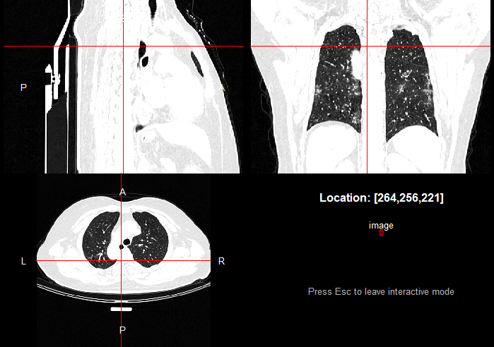

```{r setup, include=FALSE}
knitr::opts_chunk$set(eval = FALSE, message = FALSE,  warning = FALSE, comment = "")
```


## Introducción

Las imágenes médicas han sido utilizadas y mejoradas durante muchos años, y aunque aparezcan
nuevas técnicas para capturar estas imágenes, los métodos para interpretarlas siguen basandose
en las mismas características que en los inicios.

Las imágenes radiologicas son conjuntos de datos donde cada píxel o vóxel es una medida
física representada en una imagen. Estos valores pueden ser medidos mediante diferentes
métodos.

Muchos análisis con escáners de última generación descartan mucha información irrelevante
y muestran las partes más destacadas donde podría encontrarse una anomalía y así poder
analizar si es causante de una enfermedad para decidir si intervenir o no hacerlo.


## Radiomics

Radiomics es el proceso de extraer cualidades de una zona destacada de una imagen
radiológica mediante algoritmos para crear conjuntos de datos sobre las anormalidades que se encuentren en esta
y que no se pueden observar a ojo.

Existen diferentes técnicas para realizar este trabajo: métricas basadas en intensidad,
análisis basado en texturas, medidas basadas en la forma y métricas basadas en
transformación. A continuación se explicará de manera más detallada en qué consiste
cada una de estas técnicas:

Las métricas basadas en intensidad se calculan a partir de los propios valores de
vóxel sin contar con ninguna información adicional que se pueda añadir en el análisis.
Estas métricas se calculan marcando una zona destacada y extrayendo los valores de
sus vóxeles. Estas estadísticas pueden ser agrupadas por promedio y variación,
forma y diversidad.

El análisis basado en texturas se centra en la relación de espacio de los vóxeles.
Intenta cuantificar parámetros como la intensidad, forma o color usando fórmulas
matemáticas.

Las medidas basadas en la forma estudian la distribución de diferentes componentes
y sus efectos en la placa. Hay diferentes tipos:

- 1D: miden la distancia entre dos puntos y se utilizan para describir la magnitud
    de una anormalidad y así saber la forma de la lesión.
    
- 2D: son planos que se utilizan para calcular parámetros basados en áreas.
    
- 3D: pretenden abarcar diferentes aspectos de forma tridimensional de manera similar
  al 2D.

Las métricas basadas en transformación utilizan el dominio de frecuencia, producto
de la transformación de la imagen, para obtener la misma información, aunque ha de tenerse
en cuenta que se centran en trabajar diferentes características ya que ofrecen diferentes
posibilidades.


## Características

Las características destacadas o "features" tienen la capacidad de desvelar características
de alguna enfermedad que no se pueden apreciar a simple vista, y por tanto se debe usar
algún método para poder analizarlas; en este caso las radiomics.

El proceso para obtener estas características y extraer información de ellas es
el siguiente:

- Obtención de la imagen: Para empezar con el proceso, es necesaria una imagen,
  que en vez de ser tomada con cámara, se hace con un escáner ya que puede ofrecer
  imágenes con volumen. Para obtener imagenes interpretables, es necesario
  reconstruirlas.
  
- Segmentación de imagen: Después de que las imágenes sean guardadas en una base
  de datos, deben ser reducidas o "recortadas" a una parte de interés. Esto se
  debe hacer con un algoritmo, ya que es más productivo y eficaz que hacerlo a
  mano.
  
- Extracción y calificación de las características: Después de que la segmentación
  haya sido realizada, muchos features pueden ser extraídos. Se pueden dividir en
  cinco tipos diferentes.
    
- Análisis: Tras seleccionar las características que nos interesan hay que analizarlas.
  Estas características se comparan entre si para ver qué información tienen en común
  y poder ver qué diferencias hay o qué les ocurre.  Hay cientos de características
  diferentes que pueden ser estudiadas con diferentes algoritmos para que esto sea
  más eficiente.


## Tipos de características

Las características cuantitativas se pueden clasificar de la siguiente forma:

- Características de forma: Definen la región de interés y sus propiedades geométricas.
  
- Estadísticos de primera orden: Definen la distribución individual del valor de
  cada vóxel sin tener en cuenta la relación de espacio. Esto da a conocer la media,
  la mediana, el valor máximo y mínimo de la intensidad del vóxel, así como otros
  valores destacados.
  
- Estadísticos de segunda orden: Incluyen características de textura, que se obtienen
  calculando el valor de la relación entre vóxeles contiguos. Dan información sobre
  las intensidades entre los vóxeles siguiendo una dirección fija.
  
- Estadísticos de orden superior: Se obtienen a partir de métodos estadísticos
  después de aplicar filtros a las imágenes para identificar patrones.
  


## Ejemplo

En esta sección ilustramos cómo trabajar con los ficheros de imágenes para poder
sacar los features. Este código no es reproducible porque se necesita un ordenador
con más capacidad para poder ejecutar el código.

Cargamos las librerías de los paquetes RIA y RadAR.

```{r, eval=TRUE}
library(RIA)
library(RadAR)
library(RNifti)
```


Cargar cada imagen con su máscara.

```{r}
corona1 <- RIA::load_nifti(filename = "C:/Iker/ISGlobal/COVID-19/coronacases_001.nii.gz",
                           mask_filename = "C:/Iker/ISGlobal/COVID-19-MASK/coronacases_001.nii.gz")
corona2 <- RIA::load_nifti(filename = "C:/Iker/ISGlobal/COVID-19/coronacases_002.nii.gz",
                           mask_filename = "C:/Iker/ISGlobal/COVID-19-MASK/coronacases_002.nii.gz")
control1 <- RIA::load_nifti(filename = "C:/Iker/ISGlobal/COVID-19/radiopaedia_10_85902_1.nii.gz",
                            mask_filename = "C:/Iker/ISGlobal/COVID-19-MASK/radiopaedia_10_85902_1.nii.gz")
control2 <- RIA::load_nifti(filename = "C:/Iker/ISGlobal/COVID-19/radiopaedia_10_85902_3.nii.gz",
                            mask_filename = "C:/Iker/ISGlobal/COVID-19-MASK/radiopaedia_10_85902_3.nii.gz")
```


```{r, eval = FALSE}
image <- readNifti("C:/Iker/ISGlobal/COVID-19/coronacases_001.nii.gz")
view(image)
```

{width=550px}


Calcular las características de tipo first-order.

```{r}
stats_corona1 <- RIA::first_order(corona1)
stats_corona2 <- RIA::first_order(corona2)
stats_control1 <- RIA::first_order(control1)
stats_control2 <- RIA::first_order(control2)

stats_global <- data.frame(corona1 = stats_corona1,
                           corona2 = stats_corona2,
                           control1 = stats_control1,
                           control2 = stats_control2)
```


```{r}
stats_corona1 <- RIA:::list_to_df(corona1$stat_fo$orig)
stats_corona2 <- RIA:::list_to_df(corona2$stat_fo$orig)
stats_control1 <- RIA:::list_to_df(control1$stat_fo$orig)
stats_control2 <- RIA:::list_to_df(control2$stat_fo$orig)
```


```{r}
stats_global <- data.frame(corona1 = stats_corona1,
             corona2 = stats_corona2,
             control1 = stats_control1,
             control2 = stats_control2)
```


Cambiar el nombre de las columnas para cada individuo

```{r}
colnames(stats_global) <- c("corona1", "corona2", "control1", "control2")

head(stats_global)
```

Guardar archivo de la tabla

```{r}
write.table(stats_global, file = "C:/Iker/ISGlobal/Covid_features.txt", sep = "\t")
```

Importar las características

```{r}
rdr <- import_radiomic_table(file = "C:/Iker/ISGlobal/Covid_features.txt")
```


Crear una tabla con las características para cada individuo

```{r}
clinical <- data.frame(PatientID = c("corona1", "corona2", "control1", "control2"),
                       covid_status = c("covid", "covid", "no_covid", "no_covid"))

colData(rdr) <- cbind(colData(rdr), clinical)
```

Ver la correlación de las features

```{r}
plot_correlation_matrix(rdr = rdr, 
                        method_correlation = "spearman", 
                        view_as = "heatmap", 
                        which_data = "normal")
```

Escalar los valores de las features

```{r}
rdr <- scale_feature_values(rdr = rdr, method = "minmax")
```

Agrupamiento de características

```{r}
rdr <- do_hierarchical_clustering(rdr = rdr, 
                                  which_data = "scaled", 
                                  method_dist_col = "correlation.spearman")

plot_heatmap_hcl(rdr = rdr, 
                 annotation_tracks = c("covid_status"))
```


## Análisis de diez casos con Covid-19 y ocho controles

Se han analizado diez muestras con el mismo script que antes pero calculando todas
las features posibles utilizando la función `RIA::radiomics_all ()`. Dado el alto
coste computacional, se ha ejecutado en un servidor y Las features se han guardado
en un fichero que podemos importar a R como:

```{r, eval = TRUE}
rdr <- import_radiomic_table(file = "stats_global.tsv")
```
Crear una tabla con las características para cada individuo

```{r, eval=TRUE}
clinical <- data.frame(PatientID = c("corona1", "corona2", "corona3", "corona4", "corona5",
                                     "corona6", "corona7", "corona8", "corona9", "corona10",
                                     "control1", "control2", "control3", "control5",
                                     "control6", "control7", "control9", "control10"),
                       covid_status = c("covid", "covid", "covid", "covid", "covid",
                                        "covid", "covid", "covid", "covid", "covid",
                                        "no_covid", "no_covid", "no_covid",
                                        "no_covid", "no_covid", "no_covid", "no_covid", "no_covid"))

colData(rdr) <- cbind(colData(rdr), clinical)
```

Eliminar las filas sobrantes para poder ejecutar el código de manera correcta

```{r, eval=TRUE}
features.nodup <- assays(rdr)$values[-which(apply(assays(rdr)$values, 1, function(x){length(unique(x)) == 1})),]

rdr_2 <- SummarizedExperiment::SummarizedExperiment(assays = list(values = features.nodup), 
                                                    rowData = data.frame(feature_name = rownames(features.nodup)), colData = colnames(features.nodup),metadata = metadata(rdr))

colData(rdr_2) <- cbind(colData(rdr_2), clinical)
```

Ver la correlación de las features

```{r, eval=TRUE, out.width='90%', fig.width=8, fig.height=6, fig.retina=3}
plot_correlation_matrix(rdr = rdr_2, 
                        method_correlation = "spearman", 
                        view_as = "heatmap", 
                        which_data = "normal")
```

Escalar los valores de las features

```{r, eval=TRUE}
rdr_2 <- scale_feature_values(rdr = rdr_2, method = "minmax")
```

Agrupamiento de características

```{r, eval=TRUE, out.width='90%', out.height='50%', fig.width=6, fig.height=6, fig.retina=3}
rdr_2 <- do_hierarchical_clustering(rdr = rdr_2,
                                    which_data = "scaled",
                                    method_dist_col = "correlation.spearman")

plot_heatmap_hcl(rdr = rdr_2, 
                 annotation_tracks = c("covid_status"))
```


